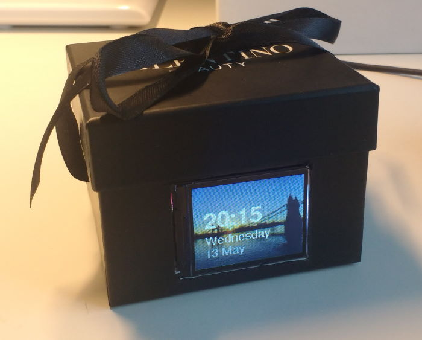

# ESP_SDCard_PhotoFrame_Clock
Simple Arduino powered PhotoFrame and Clock using an SD Card for the photo library

## What do I need for this Sketch?

* A generic 1.8" TFT Screen with SD Card Slot [like this](https://www.aliexpress.com/item/32265119437.html?spm=a2g0s.9042311.0.0.27424c4drkWFd3) 
* Bunch of hookup wire, dupoint cable
* ESP8266, such as WeMos D1 mini
* A nice little project box

## Wiring Guide

```
WebMos D1 Mini Pin -> 1.8" TFT Pin

5V    -> VCC
GND   -> GND
3.3V  -> LED 
D1			-> CS (of LCD)
D2			-> A0 (of LCD)
D5 (SCK) 	-> SCK (of LCD) + SD_SCK
D6 (MISO) 	-> SD_MISO
D7 (MOSI)   -> SDA (of LCD) + SD_MOSI
RST			-> RESET

```


## Photos
Place as many photos as you want on the SD card as a .jpeg, but resize and landscape orientation of them to 160x128.

The code currently changes photo each day, but you can change this as you desire.


